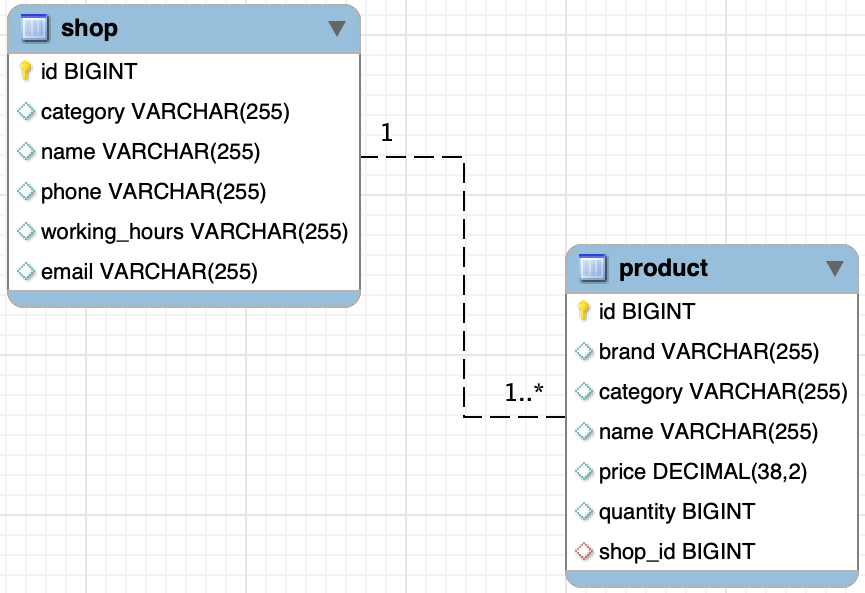

# Тестовое задание Digital chief
[Задание](Тестовое_задание_для_Trainee_Backend_Developer_JAVA.pdf)

## 1 Описание предметной области.
В предметной области "Магазин - Товары" мы рассматриваем композицию, состоящую из двух объектов: "Магазин" и "Товары". Магазин представляет собой торговое заведение, где осуществляется продажа различных товаров.

Объекты:

Магазин:
- Название: имя магазина, например, "СуперМаркет"
- Адрес: физический адрес магазина
- Рабочее время: время работы магазина
- Телефон: контактный номер телефона магазина
- Почта: электронный имейл
- Категория: тип магазина (продуктовый, электроники, одежды и т.д.)

Товары:

- Название: наименование товара, например, "Молоко"
- Цена: стоимость товара в магазине
- Количество: количество товара на складе
- Бренд: производитель товара
- Категория: тип товара (пищевой, бытовой, электронный и т.д.)
- Отношение "Магазин - Товары":

Магазин имеет множество товаров, то есть одному магазину может соответствовать несколько товаров, но каждый товар принадлежит только одному магазину.
Таким образом, в данной предметной области у нас есть множество магазинов, каждый из которых предлагает свой ассортимент товаров. Каждый магазин характеризуется своим названием, адресом, рабочим временем, телефоном и категорией. Товары, в свою очередь, имеют свои названия, цены, количество на складе, бренды и категории.

## 3 Схема БД.

На основе выбранной области был о создана схема БД, где магазин - shop, а товары product.

## 4 Зависимости и инструкция.
Зависимости в проекте:
- ***org.springframework.boot:spring-boot-starter-data-jpa*** - включает необходимые компоненты для работы с JPA в Spring Boot приложении. Она предоставляет базовую инфраструктуру для управления базой данных, выполнения запросов и работы с объектно-реляционным отображением. Так как ограничений не было использовал ее в spring data встроен пул HikariCP.
- ***org.springframework.boot:spring-boot-starter-validation*** - обеспечивает интеграцию с фреймворком валидации (Hibernate validator) в Spring Boot приложении. Она позволяет легко определять правила валидации для моделей данных и автоматически выполнять их проверку при обработке запросов.
- ***org.springframework.boot:spring-boot-starter-web*** - включает основные компоненты для разработки веб-приложений в Spring Boot. Она предоставляет HTTP-сервер, поддержку обработки запросов и обработки HTTP-сессий, а также другие полезные функции для работы с веб-интерфейсами.
- ***org.modelmapper:modelmapper:3.1.0*** - предоставляет инструменты для преобразования объектов между различными моделями данных. ModelMapper упрощает процесс отображения полей объектов, позволяя автоматически копировать данные между сущностями.
- ***org.projectlombok:lombok*** - предоставляет аннотации и инструменты для автоматической генерации методов доступа (геттеры и сеттеры), конструкторов, методов equals/hashCode и других стандартных методов Java.
- ***com.mysql:mysql-connector-j*** - предоставляет драйвер JDBC для работы с базой данных MySQL.
- ***org.springframework.boot:spring-boot-starter-test*** - включает необходимые компоненты для написания и запуска модульных и интеграционных тестов в Spring Boot приложении.

Инструкция:
В папке ресурсы находятся [Файл коллекции Postman](src/main/resources/Digital_chief.postman_collection.json) и [файл SQL](src/main/resources/init.sql).
1) Поменять [Параметры приложения](src/main/resources/application.properties) под свое БД.s
2) Можно запустить из под IDE, или выбрать build task в gradle и в папке Lib найти "shop-0.0.1-SNAPSHOT.jar" и запустить с помощью команды "java -jar -Dspring.profiles.active=dev shop-0.0.1-SNAPSHOT.jar", где dev это профиль можно еще prod. dev сгенерирует бд и таблицы.
3) Импортируйте коллекцию Postman и вставьте тестовые данные из SQL.
